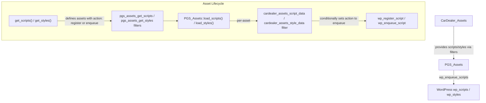

# Design Document: CarDealer Theme Optimization

## Overview

This design covers performance optimizations for the CarDealer WordPress theme's asset loading pipeline, font delivery, and HTML output. The changes target three areas:

1. **Conditional asset loading** (Requirements 1–8): Change globally-enqueued CSS/JS assets to register-only by default, then conditionally enqueue them on pages that actually need them. This uses the existing `CarDealer_Assets` filter hook pattern (`cardealer_assets_script_data` / `cardealer_assets_style_data`).

2. **Static file fixes** (Requirements 9–10): Fix the sidebar CSS to use the minified variant, and modernize the Flaticon `@font-face` declaration to drop legacy `.eot` and `.svg` formats.

3. **Markup and API cleanup** (Requirements 11–13): Upgrade the Google Fonts URL from API v1 to v2, remove IE conditional comments from `header.php`, and audit Font Awesome v4 shims usage.

All changes are confined to:
- `includes/classes/class-cardealer-assets.php` (asset definitions + conditional hooks)
- `css/frontend/flaticon.css` (font-face rule)
- `header.php` (HTML output)

No changes to `class-pgs-assets.php`, theme options, admin UI, or plugin behavior.

## Architecture

The CarDealer theme uses a two-class asset management system:



**How conditional loading works today:**

1. Each asset is defined in `get_scripts()` or `get_styles()` with an `'action'` key — either `'enqueue'` (load globally) or `'register'` (make available but don't load).
2. Before each asset is processed, `PGS_Assets` fires a filter: `cardealer_assets_script_data` (for JS) or `cardealer_assets_style_data` (for CSS).
3. `CarDealer_Assets` hooks into these filters with methods like `vehicle_detail_page_scripts()`, `blog_scripts()`, `inventory_scripts()`, etc. These methods check the current page context (e.g., `is_singular('cars')`) and flip `$script_data['action']` from `'register'` to `'enqueue'` when appropriate.

**Our approach:** For each asset that is currently `'action' => 'enqueue'` but should be conditional, we:
1. Change the default action to `'register'` in the asset definition array.
2. Add conditional enqueue logic in the appropriate existing filter callback (or a new one if no suitable callback exists).

This is the same pattern already used for `magnific-popup`, `cardealer-blog`, `slick-js`, `cardealer-vehicle-detail`, and many others.

## Components and Interfaces

### Component 1: Asset Definition Changes (get_scripts / get_styles)

**Files modified:** `class-cardealer-assets.php` — `get_scripts()` and `get_styles()` methods.

| Asset Handle | Type | Current Action | New Action | Rationale |
|---|---|---|---|---|
| `photoswipe` | JS | `enqueue` | `register` | Only needed on Vehicle_Detail_Page |
| `photoswipe-ui-default` | JS | `enqueue` | `register` | Only needed on Vehicle_Detail_Page |
| `jaaulde-cookies` | JS | `enqueue` | `register` | Only needed for compare feature / cookie consent |
| `cardealer-compare` | JS | `enqueue` | `register` | Only needed on inventory + vehicle detail pages |
| `photoswipe` | CSS | `enqueue` | `register` | Only needed on Vehicle_Detail_Page |
| `photoswipe-default-skin` | CSS | `enqueue` | `register` | Only needed on Vehicle_Detail_Page |
| `timepicker` | CSS | `enqueue` | `register` | Only needed on Vehicle_Detail_Page (booking form) |
| `cardealer-contact-form` | CSS | `enqueue` | `register` | Only needed on contact form / vehicle detail pages |
| `cardealer-woocommerce` | CSS | `enqueue` | `register` | Only needed on WooCommerce pages |
| `owl-carousel` | CSS | `enqueue` | `register` | Only needed when owl-carousel JS is enqueued |

**Sidebar CSS fix:** Change the `cardealer-sidebar` src from hardcoded `sidebar.css` to use the `$suffix` variable: `'/css/frontend/sidebar' . $suffix . '.css'`.

### Component 2: Conditional Enqueue Hooks

**Files modified:** `class-cardealer-assets.php` — existing and new filter callback methods.

#### Existing methods to extend:

**`vehicle_detail_page_scripts()`** — Add conditions for:
- `photoswipe` → enqueue when `is_singular('cars') || is_singular('cardealer_template')`
- `photoswipe-ui-default` → same condition
- `jaaulde-cookies` → enqueue (needed for compare on detail pages)
- `cardealer-compare` → enqueue

**`inventory_scripts()`** — Add conditions for:
- `jaaulde-cookies` → enqueue (needed for compare on inventory pages)
- `cardealer-compare` → enqueue

#### New method: `vehicle_detail_page_styles_extended()`

Or extend the existing `vehicle_detail_page_styles()` method to add:
- `photoswipe` CSS → enqueue on Vehicle_Detail_Page
- `photoswipe-default-skin` CSS → enqueue on Vehicle_Detail_Page
- `timepicker` CSS → enqueue on Vehicle_Detail_Page
- `cardealer-contact-form` CSS → enqueue on Vehicle_Detail_Page

#### New method or extend `additional_styles()`:

- `cardealer-contact-form` CSS → also enqueue on pages with contact form shortcode
- `cardealer-woocommerce` CSS → enqueue when `class_exists('WooCommerce')` and on WooCommerce pages (`is_woocommerce() || is_cart() || is_checkout() || is_account_page()`)
- `owl-carousel` CSS → enqueue when `cardealer-owl-carousel` JS is being enqueued (piggyback on the same page conditions: vehicle detail, inventory carousel, blog, WooCommerce product pages)

### Component 3: Google Fonts API v2 Upgrade

**Files modified:** `class-cardealer-assets.php` — `google_fonts_url()` method.

Current URL format (v1):
```
https://fonts.googleapis.com/css?family=Open+Sans:400,300,...|Roboto:100,300,...&subset=latin,latin-ext
```

New URL format (v2):
```
https://fonts.googleapis.com/css2?family=Open+Sans:ital,wght@0,300;0,400;0,600;0,700;0,800;1,300;1,400;1,600;1,700;1,800&family=Roboto:ital,wght@0,100;0,300;0,400;0,500;0,700;0,900;1,100;1,300;1,400;1,700;1,900&display=swap
```

Key changes:
- Endpoint: `fonts.googleapis.com/css2` instead of `css`
- Each font family gets its own `family=` parameter
- Weight/style uses `ital,wght@` axis notation instead of comma-separated weights
- Add `&display=swap` for font-display swap behavior
- When Redux is active and custom fonts are configured, `google_fonts_url()` already returns empty string (Redux handles its own font loading), so no change needed for that path

### Component 4: Flaticon Font Modernization

**Files modified:** `css/frontend/flaticon.css`

Remove from `@font-face`:
- `.eot` source and `?#iefix` variant
- `.svg#Flaticon` source
- The entire `@media screen and (-webkit-min-device-pixel-ratio:0)` block

Keep:
- `.woff` format
- `.ttf` format
- All icon class definitions (unchanged)

### Component 5: IE Conditional Comment Removal

**Files modified:** `header.php`

Replace the current IE conditional comment block:
```html
<!--[if IE 7]>
<html class="ie ie7" <?php language_attributes(); ?>>
<![endif]-->
<!--[if IE 8]>
<html class="ie ie8" <?php language_attributes(); ?>>
<![endif]-->
<!--[if !(IE 7) & !(IE 8)]><!-->
<html <?php language_attributes(); ?>>
<!--<![endif]-->
```

With a single clean `<html>` tag:
```html
<html <?php language_attributes(); ?>>
```

### Component 6: Font Awesome v4 Shims Audit

**Files modified:** `class-cardealer-assets.php` — add code comment documenting findings.

Based on codebase analysis, the theme uses FA6 class syntax (`fas`, `far`, `fab` prefixes) throughout. The `fa-` icon names used (e.g., `fa-search`, `fa-user`, `fa-shopping-cart`) are standard FA6 names. However, plugins and user content may still reference FA4 names. The shims should remain enqueued globally for now, with a code comment documenting the audit findings.

## Data Models

No new data models are introduced. All changes operate on the existing asset definition arrays (associative arrays with keys: `handle`, `src`, `deps`, `ver`, `action`, `context`, etc.) and the existing WordPress script/style registration system.

The only data transformation is in `google_fonts_url()`, which changes the URL string format from v1 to v2 query parameter syntax.

## Error Handling

### Asset Loading Failures

- **Missing conditional enqueue:** If a conditional enqueue hook fails to fire (e.g., a page template check returns an unexpected value), the asset remains registered but not enqueued. The page renders without that asset's functionality. This is the same failure mode as the existing conditional assets (e.g., `magnific-popup`, `cardealer-blog`). No new error handling is needed — the existing pattern is safe-by-default (assets degrade gracefully).

- **WooCommerce not active:** The `cardealer-woocommerce` CSS conditional check uses `class_exists('WooCommerce')` as a guard. If WooCommerce is deactivated, the CSS is never enqueued. The `woocommerce-general` dependency in the asset definition is only resolved when the asset is enqueued, so no errors occur when WooCommerce is absent.

- **Google Fonts API v2 fallback:** If the Google Fonts v2 endpoint is unreachable, the browser handles this the same as v1 — the font request fails and the browser falls back to the CSS `font-family` fallback stack. No server-side error handling is needed.

- **Flaticon font format removal:** Removing `.eot` and `.svg` formats means IE 8 and very old Android browsers (< 4.4) cannot load the Flaticon font. These browsers are well below any reasonable support threshold. Modern browsers will use `.woff` (preferred) or `.ttf` (fallback).

### Backward Compatibility

- All conditional loading changes use the existing filter hook pattern. Third-party code that hooks into `cardealer_assets_script_data` or `cardealer_assets_style_data` continues to work — it can still override the `action` property.
- The `cardealer-compare` localize data (`cardealer_compare_obj`) is preserved because `PGS_Assets` processes localize data during both `register` and `enqueue` actions.
- Child themes that override `header.php` are not affected (they use their own copy).

## Testing Strategy

### Why Property-Based Testing Does Not Apply

Property-based testing is not appropriate for this feature because:

- **Configuration changes:** The bulk of the work is changing `'action' => 'enqueue'` to `'action' => 'register'` in static array definitions. There is no function with a wide input space to test.
- **Simple boolean conditionals:** The conditional enqueue logic checks discrete page states (`is_singular('cars')`, `is_post_type_archive('cars')`, etc.), not a continuous or large input space. Each condition is a fixed boolean — running 100 iterations would test the same two states (true/false) repeatedly.
- **Static file edits:** The Flaticon CSS, header.php, and sidebar CSS changes are one-time file modifications, not runtime logic.
- **URL construction:** The Google Fonts URL builder produces a fixed output for fixed input (default fonts). There is no meaningful input variation.

### Testing Approach: PHP Unit Tests with WP_Mock

Use [WP_Mock](https://github.com/10up/wp_mock) or [Brain\Monkey](https://github.com/Brain-WP/BrainMonkey) to mock WordPress functions and test the `CarDealer_Assets` filter callbacks in isolation.

#### Test Suite 1: Conditional Script Loading

**Test file:** `tests/test-conditional-scripts.php`

Tests for the script filter callbacks:

1. **PhotoSwipe JS on Vehicle Detail Page:** Mock `is_singular('cars')` → true. Call `vehicle_detail_page_scripts()` with `photoswipe` script_data (action='register'). Assert action becomes 'enqueue'.
2. **PhotoSwipe JS on non-Vehicle Detail Page:** Mock `is_singular('cars')` → false, `is_singular('cardealer_template')` → false. Call `vehicle_detail_page_scripts()` with `photoswipe` script_data. Assert action remains 'register'.
3. **Compare JS on Inventory Page:** Mock `is_post_type_archive('cars')` → true. Call `inventory_scripts()` with `cardealer-compare` script_data (action='register'). Assert action becomes 'enqueue'.
4. **Compare JS on Vehicle Detail Page:** Mock `is_singular('cars')` → true. Call `vehicle_detail_page_scripts()` with `cardealer-compare` script_data. Assert action becomes 'enqueue'.
5. **Compare JS on unrelated page:** Mock all page checks → false. Verify action remains 'register'.
6. **Compare JS preserves localize data:** After conditional enqueue, verify `cardealer_compare_obj` localize data and `jquery-ui-sortable` dependency are intact.
7. **Cookies JS on Inventory Page:** Mock inventory page context. Verify `jaaulde-cookies` gets action='enqueue'.
8. **Cookies JS on non-inventory/non-detail page:** Verify action remains 'register'.

#### Test Suite 2: Conditional Style Loading

**Test file:** `tests/test-conditional-styles.php`

1. **PhotoSwipe CSS on Vehicle Detail Page:** Mock vehicle detail context. Verify `photoswipe` and `photoswipe-default-skin` CSS get action='enqueue'.
2. **PhotoSwipe CSS on non-Vehicle Detail Page:** Verify action remains 'register'.
3. **Timepicker CSS on Vehicle Detail Page:** Verify action='enqueue'.
4. **Timepicker CSS on non-Vehicle Detail Page:** Verify action remains 'register'.
5. **Contact Form CSS on Vehicle Detail Page:** Verify action='enqueue'.
6. **Contact Form CSS on non-Vehicle Detail Page:** Verify action remains 'register'.
7. **WooCommerce CSS on WooCommerce page:** Mock `class_exists('WooCommerce')` → true, `is_woocommerce()` → true. Verify action='enqueue'.
8. **WooCommerce CSS when WooCommerce inactive:** Mock `class_exists('WooCommerce')` → false. Verify action remains 'register'.
9. **WooCommerce CSS on non-WooCommerce page:** Mock WooCommerce active but `is_woocommerce()` → false, `is_cart()` → false, etc. Verify action remains 'register'.
10. **Owl Carousel CSS on blog page:** Mock blog context where `cardealer-owl-carousel` JS is enqueued. Verify `owl-carousel` CSS gets action='enqueue'.
11. **Owl Carousel CSS on non-carousel page:** Verify action remains 'register'.

#### Test Suite 3: Asset Definition Integrity

**Test file:** `tests/test-asset-definitions.php`

1. **PhotoSwipe JS default action is 'register':** Call `get_scripts()`, verify `photoswipe` and `photoswipe-ui-default` have action='register'.
2. **Cookies JS default action is 'register':** Verify `jaaulde-cookies` has action='register'.
3. **Compare JS default action is 'register':** Verify `cardealer-compare` has action='register'.
4. **Timepicker CSS default action is 'register':** Call `get_styles()`, verify `timepicker` has action='register'.
5. **Contact Form CSS default action is 'register':** Verify `cardealer-contact-form` has action='register'.
6. **WooCommerce CSS default action is 'register':** Verify `cardealer-woocommerce` has action='register'.
7. **Owl Carousel CSS default action is 'register':** Verify `owl-carousel` has action='register'.
8. **Sidebar CSS uses $suffix:** Verify `cardealer-sidebar` src contains '.min.css' when SCRIPT_DEBUG is false, and 'sidebar.css' (without .min) when SCRIPT_DEBUG is true.
9. **PhotoSwipe JS preserves all properties:** Verify handle, src, deps, ver, in_footer, context are unchanged from original values.

#### Test Suite 4: Google Fonts URL

**Test file:** `tests/test-google-fonts.php`

1. **Uses css2 endpoint:** Call `google_fonts_url()` (with no Redux), verify URL contains `fonts.googleapis.com/css2`.
2. **Uses ital,wght@ axis notation:** Verify URL contains `ital,wght@` for both Open Sans and Roboto families.
3. **Includes display=swap:** Verify URL contains `display=swap`.
4. **Separate family parameters:** Verify URL contains two `family=` parameters (one per font).
5. **Redux active returns empty:** Mock Redux class existing with custom font options. Verify returns empty string.

#### Test Suite 5: Static File Verification

**Test file:** `tests/test-static-files.php` (or manual verification)

1. **Flaticon CSS has only woff and ttf:** Parse `flaticon.css`, verify `@font-face` src contains only `.woff` and `.ttf` formats.
2. **Flaticon CSS has no eot/svg:** Verify no `.eot` or `.svg` references in `@font-face`.
3. **Flaticon CSS has no webkit media query:** Verify no `@media screen and (-webkit-min-device-pixel-ratio:0)` block.
4. **Flaticon CSS preserves all icon classes:** Verify all `.flaticon-*` class definitions are present (count should match original).
5. **Header.php has clean html tag:** Verify `<html` tag with `language_attributes()` and no IE conditional comments.
6. **Header.php preserves head content:** Verify meta charset, viewport, wp_head(), body tag are all present.

#### Test Suite 6: FA Shims Audit

1. **Shims remain enqueued:** Verify `font-awesome-shims` has action='enqueue' in `get_styles()`.
2. **Audit comment exists:** Verify a code comment near the `font-awesome-shims` asset definition documents the audit findings.

### Manual Testing Checklist

After deploying changes, verify on a staging site:

| Page Type | Expected Behavior |
|---|---|
| Homepage (non-inventory) | PhotoSwipe JS/CSS, Compare JS, Cookies JS, Timepicker CSS, Contact Form CSS, WooCommerce CSS NOT loaded |
| Vehicle Detail Page | PhotoSwipe JS/CSS, Compare JS, Cookies JS, Timepicker CSS, Contact Form CSS loaded; Owl Carousel CSS loaded |
| Inventory Archive | Compare JS, Cookies JS loaded; PhotoSwipe JS/CSS NOT loaded |
| Blog Post | Owl Carousel CSS loaded (for related posts carousel) |
| WooCommerce Shop/Product | WooCommerce CSS loaded; Owl Carousel CSS loaded on product pages |
| Non-WooCommerce page | WooCommerce CSS NOT loaded |
| Any page | Sidebar uses .min.css; Flaticon icons render correctly; Google Fonts load correctly; No IE conditional comments in source |

### Tools

- **Browser DevTools Network tab:** Verify which assets are loaded per page type
- **WordPress Query Monitor plugin:** Verify enqueued scripts/styles per page
- **Lighthouse:** Compare performance scores before/after changes
